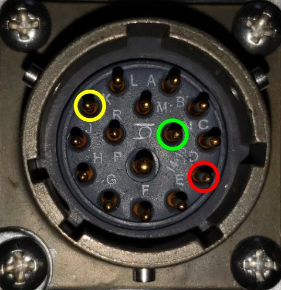

***************************
Connector Types and Pinouts
***************************

External Transmitter Control
############################

The transmitter-control connector is a **15-pin female** MIL-spec circular connector. This allows compatibility with older generation of Zonge equipment.

    Pinout of the 15-pin MIL transmitter controller connector. POL is on pin D
    (red), COMMON (GND) is on pin N (green) and ON/OFF is on pin K (yellow).

Use Zonge cable type **XMT/16-CN/6** for compatible transmitter/control
connections.

GPS Antenna Connector
=====================

The GPS antenna connects via a 50 Ohm BNC connector. Use a 3.3 V active GPS
antenna with minimum gain of 15 dB and maximum gain of 30 dB.
