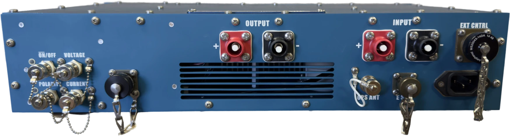

******************************
ZT-100 Controls and Connectors
******************************

Front Panel
===========

.. figure:: img/fotos/ZT100-B_front.png

    ZT100-B front panel.

From left ro right the function of the ZT100-B front panel elements are:

#. The **Keyed ON/OFF** switch is connected to the ICE 320/C-14 connector in the back. It directly interrupts power to all internal boards. The loss of power on the internal electronics will also disengage the contactor for the main power input.
#. Pushing the **Emergency switch** will disengage the contactor interrupting the positive connection from the power supply to the ZT100-B. It will also put all switching elements into an open state. The power for the digital electronics will not be interrupted by the emergency switch.
#. Make sure the **Fans** are unobstructed at all times.
#. The **black mushroom antenna** above the Reset and Transmit buttons is the WiFi antenna of the ZT100-B. Make sure it is unobstructed for optimal performance.
#. Pushing the **Reset** button starts the reset/arm sequence, or stops transmission.
#. Pushing the **TRANSMIT** button starts transmission during the arm window.
#. The 128 x 64 pixel **transflective display** is readable in bright sunlight. A LED backlight allows operation at night.
#. Three push buttons **UP**, **DOWN**, and **SELECT (MODE)** are used for menu control.

Back Panel
==========

    ZT100-B back panel.

From left ro right the function of the ZT100-B back panel elements are:

#. The four BNC monitoring outputs on the left have the following functions:
    #. The **ON/OFF** monitor provides a digital, 3.3 V amplitude signal referencing the state of the  ON/OFF control signal. This signal control the flow of current. It is an active low signal, meaning the transmitter is in an ON state (current is flowing) when this signal is low.
    #. The **Polarity** monitor provides a digital, 3.3 V amplitude signal referencing the state of the polarity control signal. This signal controls the current direction from plus to minus or minus to plus.
    #. The **Voltage** monitor provides an isolated 2 mV/V representation of the output voltage.
    #. The **Current** monitor provides an isolated 20 mV/V representation of the output current.
#. The **CAN Connector** next to the monitoring connectors connects to the internal CAN bus of the ZT100-B.
#. The **positive and negative output connectors** connect to the dipole or loop antenna used in a geophysical survey.
#. The **positive and negative input connectors** connect to the DC output of a suitable power supply. Always make sure to check the output polarity of the power supply matches the input polarity of the ZT100-B.
#. The **GPS antenna connector** is a 50 Ohm BNC connector for an active GPS antenna. The ZT100-B uses a GNSS module tracking GPS, Glonas and Baidu sattelites. Use a 3.3 V active GPS antenna with minimum gain of 15 dB and maximum gain of 30 dB.
#. The **E STP** connector allows to connect additional emergency stop switches.
#. The **External Controll** connector allows to control the switching of the ZT100-B from an external controller.
#. The IEC 320/C-14 **Power Connector** is used to supply power for the internal electronics of the ZT100-B. The digital supply voltage must be between 85 VAC and 264 VAC.

