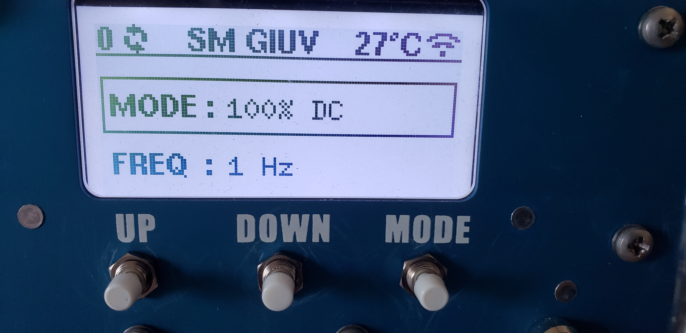
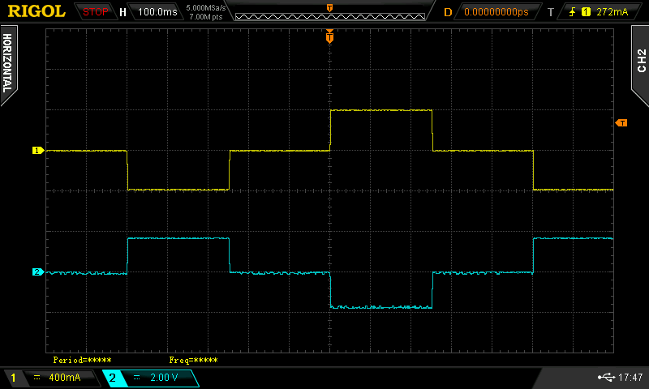

*********
First Use
*********

.. note:: Zonge recommends that new operators familiarize themselves with the equipment in a safe low voltage environment prior to using the equipment in a high voltage high current field situation.

Before You Start
================

This section describes a safe setup for the purpose of operator training without risks of a high voltage, high current environment. Such a setup is normally done in an laboratory environment. In addition to the ZT100-B you will need:

* A laboratory power supply capable to put out 10 V DC and 20 W. Ideally the power supply should have a voltage regulation and a current limiter.
* A low value high power resistor. A 4 Ohm or 10 Ohm resistor with at least 100 W will be sufficient.
* If available an oscilloscope or other kind of data-logger that can be used to display the monitoring signals.
* Cables and connectors 

Connections 
===========

* In a geophysical survey the load is either a grounded dipole or a loop antenna. For this test a resistor is used as load. Connect the two ends of the resistor with the output cables. Make sure that the connection is solid and that the ends of the connector cables can not create a short. While this test will be run at low voltages current of 1 A or more will run through the wires. Bad connections can create a significant amount of heat.
* Connect the two input connectors cables to the output of the power supply. Make sure that the connections are solid and that the polarity is correct.
* Connect the GPS antenna delivered with the ZT100-B to the antenna connector of the ZT100-B. The ZT100-B GNSS unit is very sensitive and in many cases the synchronization will work with the antenna inside of a building, but ideally the antenna should be placed outside.
* Connect the **CURRENT** and **VOLTAGE** monitoring signals to an oscilloscope using 50 Ohm BNC cables. If you have access to a 4-channel oscilloscope connect the **ON/OFF** and **POLARITY** monitor signals as well. 
* Connect the IEC 320/C-14 power connector to a household supply voltage between 85 VAC and 264 VAC.

Power On and Check Status
=========================

Power the ZT100-B On 
---------------------
Keep the laboratory power supply off for the moment and power on the ZT-100 by turning the ON/OFF key to the ON position. After a short showing of the Zonge logo the display should show: 

    ZT100-B display after turning on.

The number on the upper left shows how many GNSS satellite signal are currently received by the ZT100-B. Next to it are spinning arrow indicating that the timing of the ZT100-B is not locked to GNSS yet. 

The middle section shows SM GIUV. This is an error message. SM stands for Safety Module and GIUV stands for General Input Under Voltage. The transmitter is complaining that it does not register any input voltage as the laboratory power supply is still turned off.

The temperature shown on the right is the internal temperature of the switching modules. This value will always be 25 deg C or higher even if the actual temperature is lower.

Finally the symbol on the right indicates that the WiFi mode of the ZT100-B is switched on.

Wait for the ZT100-B to lock to GNSS
-------------------------------------

Over the next couple of minutes the satellite count should increase. When enough GNSS satellite signals are received the ZT100-B will synchronize its internal timing with the PPS from the GNSS module. The timing is now locked to GNSS. This is indicated by a small padlock symbol replacing the spinning arrows.

Power Up the Laboratory Power Supply
====================================
Set the laboratory power supply to a voltage higher than 2 V. For convenience use a voltage that in combination with the resistor results in a 1 A signal. Make sure the current limiter of the power supply is set to a current of no more than 2 A. 

After tunning the power supply on press the **RESET** button of the ZT100-B. The transmitter will perform some tests and should show RESET in the middle of the upper display row.

Set Mode and Frequency
======================
To change the operating mode (**100% DC**, **50%**, **Custom**, or **MMR 5Hz**) the **DOWN** button has to be pressed longer than a second. This is to prevent spontaneous change of mode during operation.

.. note:: In **MMR 5Hz** mode, frequency is fixed at 5 Hz and cannot be edited.

The frequency can be changed by pressing the **MODE** button shortly and then selecting the desired frequency with the **UP** and **DOWN** buttons.

Start Transmit
==============

1. Press **RESET**.
2. You then have about 2 seconds to press **TRANSMIT**.
3. If everything is fine and load checks pass, transmit starts.

    Current waveform (yellow) and voltage waveform (blue) for a 0.5 Hz 50% duty cycle waveform.

Stop Transmit
=============

- Press either **RESET** or **TRANSMIT** to stop output.

Web Interface (Optional)
========================

1. Enable Wi-Fi on the device.
2. In hotspot mode, connect to `ZT-100`.
3. Open ``http://10.10.10.10/`` in a browser.
4. Or use the mobile app. It automatically connects to the correct network and
   IP address.

.. list-table::
   :widths: 50 50

   * - .. image:: img/webapp_phone/phone_03.png
          :alt: Phone web interface quick-start view (left)
          :width: 95%
     - .. image:: img/webapp_phone/phone_04.png
          :alt: Phone web interface quick-start view (right)
          :width: 95%

For details, see :doc:`menu_structure` and :doc:`web_interface`.
