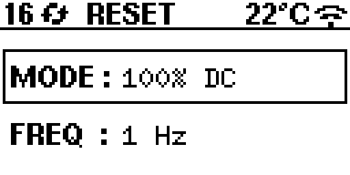
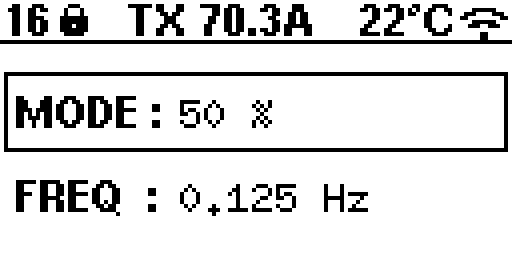
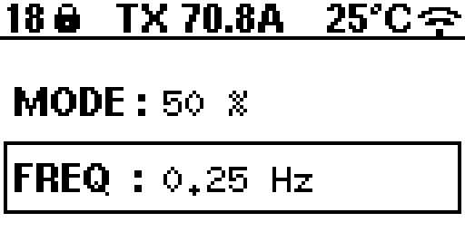
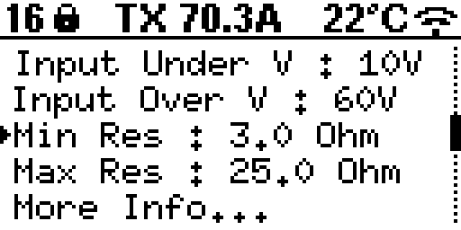
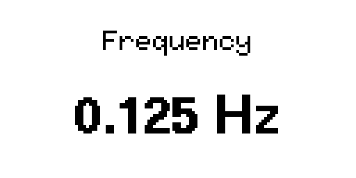
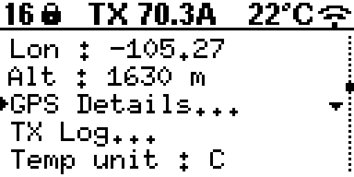
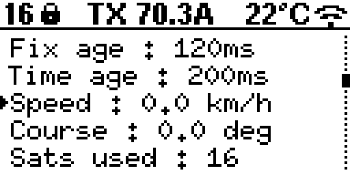

Basic Use and Menu Structure
============================

Main Page Overview
------------------

The main page provides a quick view of essential information:

- **Selected Mode**
- **Frequency**

The top status area shows:

- **Number of satellites** (GPS fix quality)
- **Sync status** (searching vs locked)
- **ZT-100 ID**
- **Wi-Fi status**

Button Basics
-------------

Long-press is about 2 seconds.

- **UP (short press)**: Move up in menus or increase a value.
- **DOWN (short press)**: Move down in menus or decrease a value.
- **SELECT (short press)**: Toggle selection on the main screen or select a
  menu item.
- **UP/DOWN (long press)**: Adjust Mode on the main screen or make fine changes
  in the value editor.
- **SELECT (long press)**: Enter/exit menus or confirm a value edit.
- **RESET**: Starts the reset/arm sequence, or stops transmit.
- **TRANSMIT**: Starts transmit during the arm window, or stops transmit.

Mode Adjustment on Main Page
----------------------------

To switch modes on the main page:

1. Make sure **MODE** is selected (use **SELECT**).
2. Press and hold **UP** or **DOWN** for about 2 seconds.

Frequency Adjustment on Main Page
---------------------------------

To adjust frequency on the main page:

1. Make sure **FREQUENCY** is selected (use **SELECT**).
2. Use **UP/DOWN** to increase or decrease the frequency.

Modes
-----

- **100% DC**: Full frequency range.
- **50%**: Limited frequency range (currently 0.0078125 Hz to 32 Hz).
- **Custom**: User-defined sequence mode (file upload via web app).
- **MMR 5Hz**: Fixed 5 Hz mode (frequency selection hidden).

In **Basic** XMT mode, only **100% DC** and **50%** are available. In
**Advanced** XMT mode, all four modes are available.
You can switch between **Basic** and **Advanced** either from the device menu
(**More Info -> XMT Mode**) or from the web interface **More** panel.

Menu Options
------------

From the MENU screen you can:

- Adjust **Input Under Voltage** and **Input Over Voltage** limits.
- Adjust **Minimum Resistance** and **Maximum Resistance** limits.
- Open **More Info...** for status and system tools.

Value Editor
------------

Selecting a limit opens the value editor:

- **UP/DOWN (short press)**: Coarse steps.
- **UP/DOWN (long press)**: Fine steps.
- **SELECT (short press)**: Toggle coarse/fine mode.
- **SELECT (long press)**: Save and return.

More Info Screen
----------------

The More Info screen shows status and configuration:

- **XMT Mode**: Toggle Basic/Advanced.
- **GPS Time** / **GPS Date**
- **Latitude / Longitude / Altitude**
- **GPS Details...**: Opens the GPS details list.
- **TX Log...**: Opens the transmit event log.
- **Temp unit**: C or F.
- **Version**: Firmware version.
- **ZT-100 #**: Instrument ID.
- **Screen Light**: On/Off.
- **Wi-Fi status**: On/Off.
- **IP**: Shown when Wi-Fi is enabled.

GPS Details Screen
------------------

The GPS details list includes:

- HDOP
- Fix age and time age
- Speed and course
- Satellites used
- GPS satellites and GLONASS satellites
- PPS count

Transmit Workflow (Step-by-Step)
--------------------------------

1. Press **RESET** to start the reset/arm sequence.
2. The system checks all protection and status conditions.
3. If no errors are reported, the screen shows **RDY** (arm window).
4. Press **TRANSMIT** during the arm window.
5. The system measures load resistance (**MOR**).
6. If the load is in range, transmit begins. If not, **ORE** is shown.
7. Press **TRANSMIT** or **RESET** to stop transmit and return to safe state.

Status Labels (Top Bar)
-----------------------

The top bar shows a short label for the transmit state. Common labels are:

- **ZT-100**: Boot/initial state.
- **RESET**: Reset sequence active or waiting in safe state.
- **RDY**: Armed window open for transmit.
- **MOR**: Measuring load resistance.
- **ORE**: Load resistance out of range or timed out.
- **TRANSMIT**: Transmit active.
- **STOPPED**: Transmit stopped by operator.
- **ERR**: Shared error line asserted (failsafe wait state).
- **R x.x**: Last measured resistance shown during transmit.
- **TX x.xA**: RMS current shown during transmit.

Error Labels (Subsystem Codes)
------------------------------

Error labels appear in the top bar and in the TX Log. Any error forces the
system back to a safe wait state.

Module codes:

- **SM** = Safety system
- **MM** = Monitoring system
- **GM** = Gate driver system
- **FM** = Cooling/fan system

Safety System (SM) errors:

- **SM EMER**: Emergency stop input active.
- **SM GIUV**: Global input under-voltage triggered.
- **SM GIOV**: Global input over-voltage triggered.
- **SM UDIUV**: User-defined under-voltage limit triggered.
- **SM UDIOV**: User-defined over-voltage limit triggered.
- **SM LERR**: Safety system local error.
- **SM ERR**: Other safety system error.

Monitoring System (MM) errors:

- **MM OVP**: Over-voltage positive.
- **MM OVN**: Over-voltage negative.
- **MM OCP**: Over-current positive.
- **MM OCN**: Over-current negative.
- **MM LERR**: Monitoring system local error.
- **MM ERR**: Other monitoring system error.

Gate Driver System (GM) errors:

- **GM OTMP**: Gate driver over-temperature.
- **GM LERR**: Gate driver local error.

Cooling/Fan System (FM) errors:

- **FM LERR**: Cooling/fan system local error.
