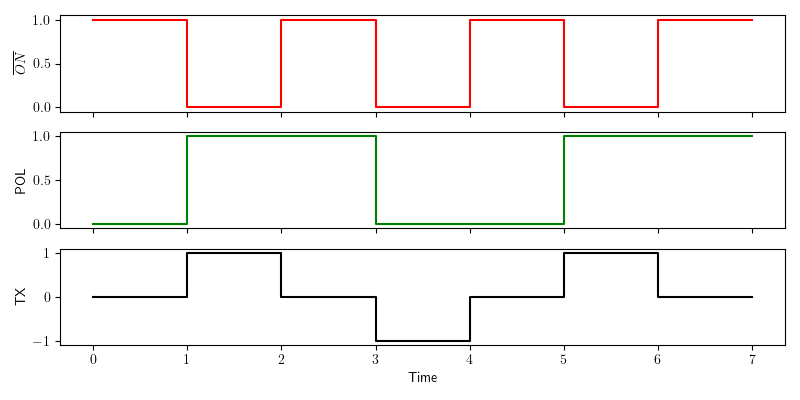

Generate User Defined Sequences
===============================

In addition to the pre-programmed 50% and 100% duty-cycle control signals the
ZT-100 allows user-defined control signals in **Custom** mode. This enables
specialized ternary transmission sequences when required by the survey design.

Control Signals
---------------

The transmitter output can have three states:

#. Positive ON
#. OFF
#. Negative ON

Positive ON and Negative ON refer to current flow through the transmitter in
opposite directions. The ZT-100 defines the output signal using two binary
control signals:

#. ON#
#. POL

Each control signal can be LOW or HIGH. HIGH corresponds to 3.3 V and LOW
corresponds to 0 V.

- **ON#** controls whether the transmitter is on. The `#` indicates **active
  low**. When ON# is LOW the transmitter is on; when ON# is HIGH the transmitter
  is off.
- **POL** controls the direction of current flow. POL HIGH corresponds to
  positive current flow, POL LOW corresponds to negative current flow.

Output Signal Example
---------------------

    Generation of a 50% duty-cycle output signal.

The red graph shows ON#, the green graph shows POL, and the black graph shows
resulting transmitter output. The sequence includes all three states.

.. note:: The control signals are binary and do not contain amplitude
   information. The output signal amplitude is set on the transmitter hardware.

Generating the Signal Definition File
-------------------------------------

To use a user-defined signal, create a **.usm** file and upload it via the web
interface. The file contains a sequence of control signal states. At each base
clock tick, the next POL and ON# values are read and applied. When the end of
file is reached the sequence loops back to the beginning.

File Format
-----------

The .usm file is stored in binary form and contains three parts:

#. Sequence length
#. List of POL entries
#. List of ON# entries

The sequence length is a 16-bit unsigned integer in big-endian byte order,
allowing up to 65,536 entries.

POL and ON# entries are stored as packed bits. Every eight consecutive bits are
stored as a byte. If the sequence length is not a multiple of 8, pad the final
byte with zeros. The firmware ignores padded bits based on the length value.

Example: Generate a PRBS .usm File
----------------------------------

The following Python code generates a 4th order PRBS sequence file:

.. code-block:: python
    :linenos:

    import numpy as np
    np.set_printoptions(formatter={'int':hex})

    pol = [1,1,0,0,0,1,0,0,1,1,0,1,0,1,1]           # sequence for polarity
    on_ = [0,0,0,0,0,0,0,0,0,0,0,0,0,0,0]           # sequence for ON# (active low)
    slen = len(pol)                                 # sequence length

    # Pad to a multiple of 8
    apol = 8-len(pol)%8
    for i in range(apol):
        pol.append(0)
        on_.append(0)

    pol_bytes = (np.packbits(np.array(pol),bitorder='big'))
    on_bytes  = (np.packbits(np.array(on_),bitorder='big'))
    print(pol_bytes)
    print(on_bytes)

    print('Sequence length = {}, {}'.format(slen,slen.to_bytes(2,byteorder='big')))
    print("Pol array = {}".format(pol))
    print("ON_ array = {}".format(on_))

    with open ("PRBS_4.usm", "wb") as binary_file:
        binary_file.write(slen.to_bytes(2,byteorder='big'))
        binary_file.write(pol_bytes)
        binary_file.write(on_bytes)

Uploading a .usm File
---------------------

1. Enable Wi-Fi on the ZT-100.
2. Open the web interface and switch to **Custom** mode.
3. Use the file loader to upload the .usm file.

Transmitting a User Defined Sequence
------------------------------------

The .usm file defines the control sequence only. Select the desired base
frequency in the web interface to generate the final transmitter waveform.
