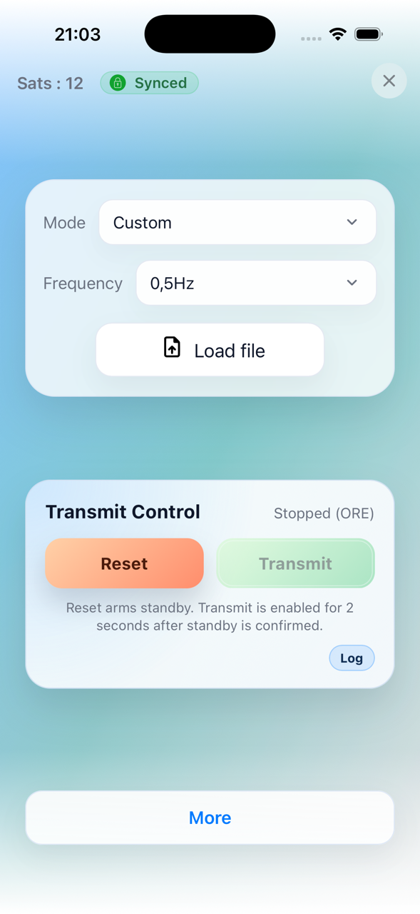
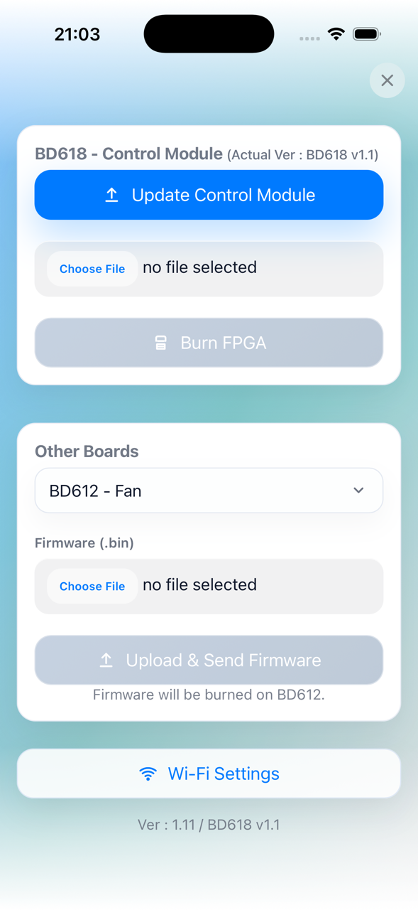
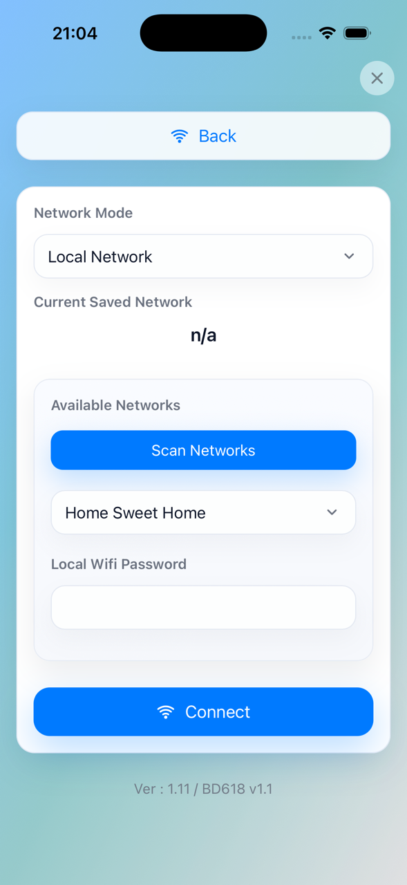

Using the Web Interface
=======================

Overview
--------

When Wi-Fi is enabled on the ZT-100, the device hosts a web interface
that mirrors the front-panel controls and provides administrative tools.

Mobile App Availability
-----------------------

The app is available on the Apple App Store as **Zonge ZT-100**.
An Android version is planned for release soon.

Hotspot mode (default):

- Join the device Wi-Fi network (SSID typically `ZT-100`).
- Open a browser and go to ``http://10.10.10.10/``.
- Or use the mobile app, which automatically connects to the correct network
  and IP address.

If the device is on a local network, use its IP address instead.

Main Page Controls
------------------

The main page shows GPS status, sync status, mode, and frequency. It also
provides transmit control and the TX log.

.. list-table::
   :widths: 50 50

   * - .. image:: img/webapp_phone/phone_03.png
          :alt: Phone web interface main page overview (left)
          :width: 95%
     - .. image:: img/webapp_phone/phone_04.png
          :alt: Phone web interface main page overview (right)
          :width: 95%

**Mode**

- Select **100% DC**, **50%**, **Custom**, or **MMR 5Hz**.
- In **Basic** XMT mode, only **100% DC** and **50%** appear.
- In **Advanced** XMT mode, all four modes appear.

**Frequency**

- Sets frequency from 0.0078125 Hz up to 8192 Hz.
- In **50%** mode the maximum is limited (currently 32 Hz).
- In **MMR 5Hz** mode, frequency selection is hidden.

**Custom Files (Custom mode)**

- A file loader and file list appear only in **Custom** mode.
- Upload **.usm** files. The UI rejects files larger than 256 KB.
- Use the list to select the active custom file.

**Transmit Control**

- **RESET**: Starts the reset/arm sequence, or stops transmit.
- **TRANSMIT**: Starts transmit during the arm window, or stops transmit.
- **Status line**: Shows `Stopped`, `Standby ready`, `Transmitting`, and
  includes the current status label in parentheses.

**More**

- Opens a panel with GPS time, latitude, longitude, altitude, and **XMT Mode**
  (Basic/Advanced).
- You can switch between **Basic** and **Advanced** here, or from the device
  screen menu (**More Info -> XMT Mode**).

How to Transmit (Web UI)
-------------------------

1. Click **Reset**.
2. You then have about 2 seconds to click **Transmit**.
3. If everything is fine and load checks pass, transmit starts.
4. Click **Stop** to end transmit.

Admin Page
----------

Navigate to ``/admin`` for firmware and FPGA updates.

- **Update Main Firmware**: Upload the firmware for the main controller.
- **Burn FPGA**: Upload the FPGA image.
- **Other Hardware Targets**: Select the target listed in the UI and upload the
  matching firmware file.

If the selected target and firmware file do not match, the upload is rejected.

Wi-Fi Settings Page
-------------------

Navigate to ``/wifi`` from the Admin page.

- **Network Mode**: Hotspot or Local Network.
- **Scan Networks**: Populate the available SSID list.
- **Connect**: Apply the selected mode and credentials.

